**ESP32 Parking Slot Monitor**


A compact, Wi-Fi‑enabled parking status monitor using an ESP32, six HC‑SR04 ultrasonic sensors, and LEDs to indicate occupied slots. Data is served as JSON via a built‑in web server.

---

## 📋 Contents
1. [Requirements](#requirements)
2. [Pinout & Wiring](#pinout--wiring)
3. [Mermaid Wiring Diagram](#mermaid-wiring-diagram)
4. [Step-by‑Step Instructions](#step-by-step-instructions)
5. [Web Interface & Testing](#web-interface--testing)

---

## Requirements
- ESP32 development board (e.g., Wemos Lolin, DevKitC)
- 6 × HC‑SR04 ultrasonic sensors
- 6 × LEDs + resistors (220 Ω)
- Jumper wires & breadboard (or perfboard)
- 5V power supply for sensors; 3.3V for ESP32 logic

---

## Pinout & Wiring

| Slot | Sensor Trigger | Sensor Echo | LED Pin (GPIO) |
|:----:|:--------------:|:-----------:|:--------------:|
| 1    | 13             | 12          | 2              |
| 2    | 14             | 27          | 4              |
| 3    | 26             | 25          | 15             |
| 4    | 33             | 32          | 16             |
| 5    | 5              | 18          | 17             |
| 6    | 19             | 21          | 22             |

---

## Mermaid Wiring Diagram

```mermaid
flowchart TB
  subgraph ESP32
    A13[GPIO 13 TRIG1]
    A12[GPIO 12 ECHO1]
    A14[GPIO 14 TRIG2]
    A27[GPIO 27 ECHO2]
    A26[GPIO 26 TRIG3]
    A25[GPIO 25 ECHO3]
    A33[GPIO 33 TRIG4]
    A32[GPIO 32 ECHO4]
    A5[GPIO 5 TRIG5]
    A18[GPIO 18 ECHO5]
    A19[GPIO 19 TRIG6]
    A21[GPIO 21 ECHO6]
    L2[GPIO 2 LED1]
    L4[GPIO 4 LED2]
    L15[GPIO 15 LED3]
    L16[GPIO 16 LED4]
    L17[GPIO 17 LED5]
    L22[GPIO 22 LED6]
  end

  subgraph Slot1[Slot 1]
    HC1Trig[TRIG]
    HC1Echo[ECHO]
    LED1(LED)
  end
  HC1Trig --> A13
  HC1Echo --> A12
  LED1 --> L2

  subgraph Slot2[Slot 2]
    HC2Trig[TRIG]
    HC2Echo[ECHO]
    LED2(LED)
  end
  HC2Trig --> A14
  HC2Echo --> A27
  LED2 --> L4

  subgraph Slot3[Slot 3]
    HC3Trig[TRIG]
    HC3Echo[ECHO]
    LED3(LED)
  end
  HC3Trig --> A26
  HC3Echo --> A25
  LED3 --> L15

  subgraph Slot4[Slot 4]
    HC4Trig[TRIG]
    HC4Echo[ECHO]
    LED4(LED)
  end
  HC4Trig --> A33
  HC4Echo --> A32
  LED4 --> L16

  subgraph Slot5[Slot 5]
    HC5Trig[TRIG]
    HC5Echo[ECHO]
    LED5(LED)
  end
  HC5Trig --> A5
  HC5Echo --> A18
  LED5 --> L17

  subgraph Slot6[Slot 6]
    HC6Trig[TRIG]
    HC6Echo[ECHO]
    LED6(LED)
  end
  HC6Trig --> A19
  HC6Echo --> A21
  LED6 --> L22
```


---

## Step-by‑Step Instructions
1. **Power Rails:**
   - Connect ESP32 `3.3V` pin to sensor `Vcc` and LED anodes via resistors.
   - Connect ESP32 `GND` to sensors `GND` and LED cathodes.
2. **Sensor Wiring:**
   - For each slot, wire the HC‑SR04 `TRIG` to the ESP32 trigger GPIO.
   - Wire the HC‑SR04 `ECHO` to the ESP32 echo GPIO (use `INPUT_PULLDOWN`).
3. **LED Wiring:**
   - Place a 220 Ω resistor in series with each LED.
   - Connect the resistor output to the LED anode; LED cathode goes to ESP32 `GND`.
   - Drive the LED’s resistor input from its corresponding ESP32 GPIO.
4. **Double‑check:**
   - TRIG pins must be `OUTPUT`, ECHO pins `INPUT_PULLDOWN`.
   - LEDs must light only when slot is occupied (<50 cm distance).
5. **Deploy Code:**
   - Flash the provided `*.ino` sketch.
   - Open serial monitor at 115200 baud to verify sensor detection and IP address.
6. **Test Web Server:**
   - Visit `http://<ESP32_IP>/` every second to view JSON status.
   - Confirm LEDs toggle according to occupancy.

---

## Web Interface & Testing
- JSON structure:
  ```json
  {
    "type": "parking_status",
    "slots": [
      { "id":1, "occupied":true, "distance_cm":32.5 },
      …
    ]
  }
  ```
- Use any REST client or browser to poll the endpoint.
- Integrate with a dashboard (e.g., Node-RED, Home Assistant).

---

Feel free to contribute improvements or file issues in the repository!

