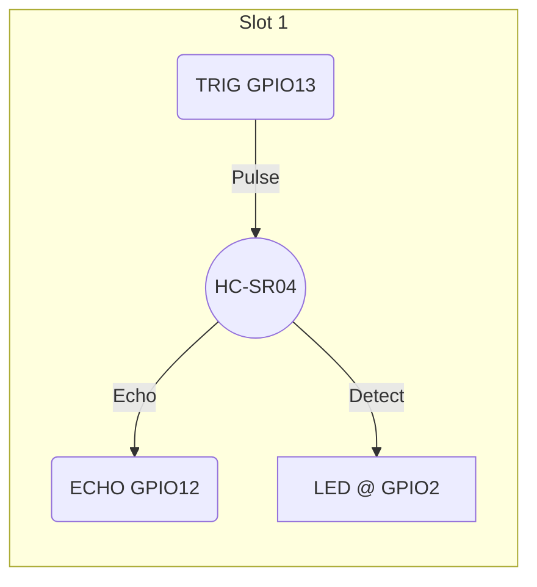
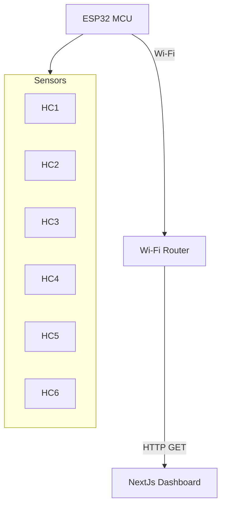

**Smart Parking Slot Monitor 🚗🔍**

[](https://opensource.org/licenses/MIT) [](https://www.espressif.com/en/products/socs/esp32) [](https://Nextjs.org/) [](#api)

> _"Revolutionizing urban parking with seamless IoT integration and real‑time monitoring!"_

---

## 📖 Table of Contents
1. [✨ Overview](#✨-overview)
2. [🛠️ Features](#️-features)
3. [📦 Hardware Requirements](#-hardware-requirements)
4. [📐 Wiring & Pinout](#-wiring--pinout)
5. [⚙️ Software Setup](#️-software-setup)
   - ESP32 Firmware
   - NextJs Dashboard
6. [🔧 Installation & Usage](#-installation--usage)
7. [🌐 Web API & JSON Format](#-web-api--json-format)
8. [🗺️ Architecture Diagram](#️-architecture-diagram)
9. [👨‍💻 Contributing](#-contributing)
10. [📄 License](#-license)

---

## ✨ Overview
A compact, Wi‑Fi enabled smart parking monitor built on the ESP32, equipped with six HC‑SR04 ultrasonic sensors and intuitive LEDs. It serves real‑time parking slot data as JSON and integrates seamlessly with a NextJs front‑end dashboard for live visualization.

---

## 🛠️ Features
- **Real‑time Monitoring**: Polls every second via HTTP GET
- **Sensor Autodetect**: Detects which ultrasonic sensors are attached
- **Visual Indicators**: On‑board LEDs show occupancy status
- **Rich Front‑end**: NextJs + Framer Motion dashboard with animated status cards
- **Resilient**: Handles sensor disconnects and network failures gracefully
- **Extensible**: JSON API for integration with Node‑RED, Home Assistant, etc.

---

## 📦 Hardware Requirements
| Component              | Quantity | Notes                     |
|------------------------|:--------:|---------------------------|
| ESP32 Dev Board        |    1     | Wemos Lolin, DevKitC, etc |
| HC‑SR04 Ultrasonic     |    6     | Sensor range 2–400 cm     |
| LEDs + 220 Ω Resistors |    6     | Any color                 |
| Breadboard & Jumper Wires | —     | For prototyping           |
| Power Supply           | 5 V @ 1 A | For sensors; 3.3 V for ESP|

---

## 📐 Wiring & Pinout
| Slot | TRIG (GPIO) | ECHO (GPIO) | LED (GPIO) |
|:----:|:-----------:|:-----------:|:----------:|
| 1    | 13          | 12          | 2          |
| 2    | 14          | 27          | 4          |
| 3    | 26          | 25          | 15         |
| 4    | 33          | 32          | 16         |
| 5    | 5           | 18          | 17         |
| 6    | 19          | 21          | 22         |

<details>
<summary>Mermaid Diagram</summary>


</details>

---

## ⚙️ Software Setup

### ESP32 Firmware
1. Clone this repo.
2. Open `SmartParking.ino` in Arduino IDE or PlatformIO.
3. Adjust `ssid`, `pass`, and pin arrays if needed.
4. Flash to ESP32 at 115200 baud.
5. Open Serial Monitor to view detected sensors and IP address.

### Next Dashboard
1. Navigate to `/web-dashboard` folder.
2. Install dependencies:
   ```bash
   npm install
   ```
3. Start dev server:
   ```bash
   npm run dev
   ```
4. Enter ESP32 IP when prompted and watch slots animate live.

---

## 🔧 Installation & Usage
1. Wire hardware as per the pinout above.
2. Power on ESP32 and sensors.
3. Flash firmware and connect ESP to Wi‑Fi.
4. Note the IP printed in Serial Monitor.
5. Launch dashboard and input IP.
6. Enjoy real‑time parking visualization!

---

## 🌐 Web API & JSON Format
**Endpoint:** `http://<ESP32_IP>/`

```json
{
  "type": "parking_status",
  "slots": [
    { "id": 1, "occupied": true, "distance_cm": 32.5 },
    { "id": 2, "occupied": false, "distance_cm": 120.1 },
    …
  ]
}
```

- **id**: Slot number (1–6)
- **occupied**: `true` if distance < 50 cm
- **distance_cm**: Measured distance (−1 if no sensor)

---

## 🗺️ Architecture Diagram


---

## 👨‍💻 Contributing
Contributions are welcome! Please:
1. Fork the repo.
2. Create a feature branch.
3. Submit a PR with clear description.

---

## 📄 License
This project is licensed under the MIT License. See [LICENSE](./LICENSE) for details.

---

> _Crafted with ❤️ for hackers, makers, and smart‑city enthusiasts!_

